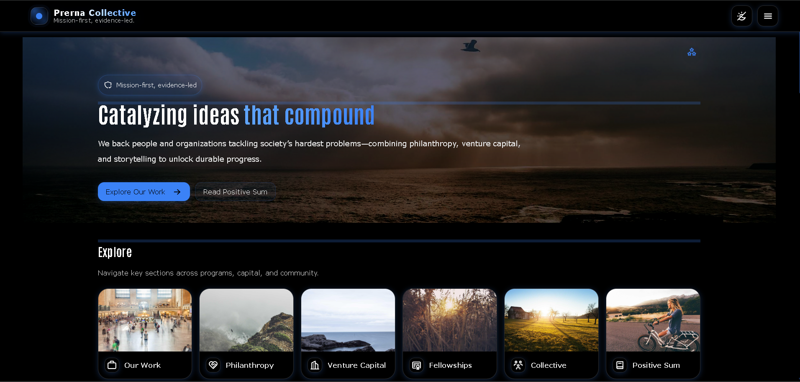

# Prerna Collective



A refactored React frontend for one of my freelance client projects - **mission-first, evidence-led, and design-driven.**  
Built entirely with **React (Vite)** + **styled-components**, it's fully modular, deployable to GitHub Pages, and tuned for performance and UX polish.

-   **GitHub:** [https://github.com/a2rp/prerna-collective](https://github.com/a2rp/prerna-collective)
-   **Live:** [https://a2rp.github.io/prerna-collective/](https://a2rp.github.io/prerna-collective/)

---

## 🧩 Overview

This is a **frontend-only refactor** of a client site focused on venture storytelling, philanthropy, and fellowship programs.  
All content is static (JSON/MDX under `public/data`), rendered via modern React routes with smooth transitions, lazy loading, and advanced UI theming.

### ✨ Highlights

-   Responsive layout with **fixed 60 px header** and theme toggle
-   Dynamic **breadcrumbs**, **drawer navigation**, and **sticky TOC**
-   Reusable legal & company pages with consistent styling
-   Styled-components-based theme tokens (`theme.css` + `index.css`)
-   Blue-dominant brand palette with pure black/white neutrals
-   Lightweight, SEO-friendly, and deployable as a static app

---

## 🚀 Getting Started

```bash
# Clone the repo
git clone https://github.com/a2rp/prerna-collective.git
cd prerna-collective

# Install dependencies
npm install

# Start development server
npm run dev
# Visit http://localhost:5173
```
