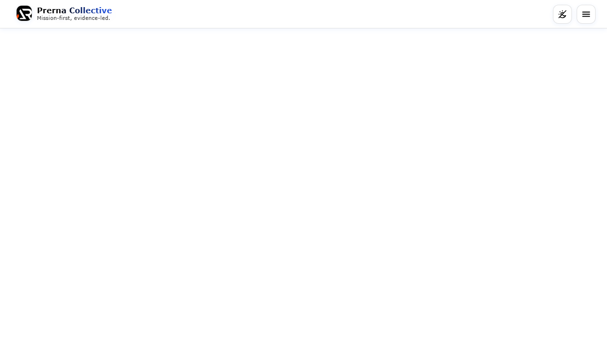

# Prerna Collective

A responsive React frontend for mission-first storytelling across venture capital, philanthropy, fellowships, community programs, and careers.



## Features

- React Router pages with lazy-loaded route components.
- Fixed header with local logo, theme toggle, and accessible navigation drawer.
- Responsive pages for work, collective programs, legal content, careers, and contact.
- Reusable styled-components theme tokens and a floating back-to-top control.
- Icon-only social and support links in the footer.
- GitHub Pages deployment with route-aware metadata.

## Tech stack

React, Vite, React Router, styled-components, React Icons, MUI, Zustand, Recharts, Dexie, and local public assets.

## Run locally

```bash
npm install
npm run dev
```

Validate, build, and deploy:

```bash
npm run lint
npm run build
npm run deploy
```

Live URL: [a2rp.github.io/prerna-collective](https://a2rp.github.io/prerna-collective/)

## Links

- [Portfolio](https://www.ashishranjan.net/)
- [GitHub](https://github.com/a2rp)
- [CodePen](https://codepen.io/ash1198)
- [LinkedIn](https://www.linkedin.com/in/aashishranjan)
- [Facebook](https://www.facebook.com/theash.ashish/)
- [YouTube](https://www.youtube.com/@ashishranjan-ashz?sub_confirmation=1)

## Support

- [Support](https://a2rp-donation-page.netlify.app/)
- [Buy Me a Coffee](https://buymeacoffee.com/a2rp)
- [Patreon](https://patreon.com/a2rp)

## License

MIT License. See [LICENSE](LICENSE).
